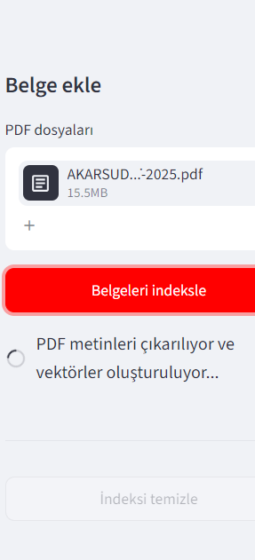
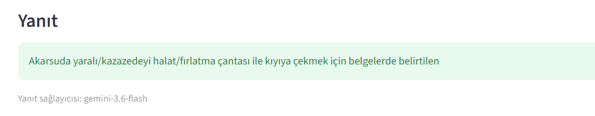
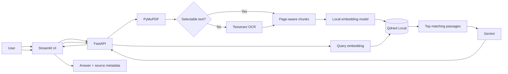

# PDF RAG Assistant


**A general-purpose Retrieval-Augmented Generation application for asking source-grounded questions across text-based and scanned PDF documents.**

I built this project as a Statistics graduate who wanted to move beyond model notebooks and understand how an end-to-end AI application works: document ingestion, OCR, embeddings, vector search, API design, grounded generation, testing, and deployment basics.

> For a few personal PDFs, uploading files directly to ChatGPT or Gemini may be simpler. This project focuses on the engineering behind a reusable document-search application: persistent indexing, local retrieval, page-level traceability, and an API that can be integrated into another product.

## Demo

| PDF indexing | Grounded answer |
|---|---|
|  |  |

## What the project does

```text
PDF upload
→ page-aware text extraction
→ OCR fallback for image-only pages
→ overlapping text chunks
→ local multilingual embeddings
→ Qdrant vector retrieval
→ question + retrieved passages sent to Gemini
→ answer with filename and page references
```

The uploaded PDFs, extracted text, embedding vectors, Qdrant data, and embedding-model cache remain local by default. Gemini receives only the user's question and the limited set of passages selected by the retrieval layer. Numeric embedding vectors are not sent to Gemini.

## Main features

- Multi-PDF upload and persistent indexing
- Page-aware extraction with PyMuPDF
- Automatic Tesseract OCR fallback for scanned pages
- Turkish and English OCR support
- Local multilingual embeddings with Sentence Transformers
- Qdrant Local vector database
- Configurable semantic retrieval with top-k and score threshold
- Gemini answer generation with numbered source references
- Filename, page, chunk, similarity score, and source-passage display
- FastAPI REST API and interactive OpenAPI documentation
- Streamlit interface
- JSON answer export
- Health-aware local launcher
- Windows setup and OCR installation scripts
- Docker and Docker Compose files
- Pytest, Ruff, GitHub Actions, and Dependabot configuration
- Runtime data and secrets excluded from Git

## Architecture



More detail is available in [docs/ARCHITECTURE.md](docs/ARCHITECTURE.md).

## Technology stack

| Layer | Technology |
|---|---|
| Interface | Streamlit |
| API | FastAPI + Pydantic |
| PDF processing | PyMuPDF |
| OCR | Tesseract OCR |
| Embeddings | Sentence Transformers |
| Vector database | Qdrant Local |
| Answer generation | Gemini API via `google-genai` |
| Testing and quality | Pytest, Ruff, GitHub Actions |
| Packaging | Docker, Docker Compose, Windows scripts |

## Quick start on Windows

### 1. Clone and create the environment

```powershell
git clone https://github.com/oguzhanbekmezci6/pdf-rag-assistant.git
cd pdf-rag-assistant
py -m venv .venv
.\.venv\Scripts\Activate.ps1
python -m pip install --upgrade pip
python -m pip install -r requirements.txt
```

### 2. Configure Gemini

```powershell
Copy-Item .env.example .env
```

Add your Google AI Studio key to `.env`:

```env
GEMINI_API_KEY=your_real_key
GEMINI_MODEL=gemini-3.6-flash
```

Never commit the `.env` file.

### 3. Install OCR for scanned PDFs

```powershell
.\install_ocr_windows.bat
python scripts\check_ocr.py
```

Restart PyCharm and open terminals again after installing Tesseract.

### 4. Run the application

```powershell
python run_project.py
```

The launcher starts the API and UI, verifies backend health, selects free local ports when required, and opens the correct browser URL.

Default addresses:

- UI: `http://127.0.0.1:8501`
- API docs: `http://127.0.0.1:8000/docs`
- Health endpoint: `http://127.0.0.1:8000/health`

## Usage

1. Select one or more PDF documents in the sidebar.
2. Click **PDF'leri indeksle**.
3. Ask a question whose answer should exist in the indexed documents.
4. Review the answer and inspect the retrieved source passages.
5. Check the filename, page number, similarity score, and original text before relying on the response.

The application can work with research papers, football reports, court decisions, technical manuals, annual reports, lecture notes, policies, regulations, and other PDF-based text sources.

### OCR test document

The repository includes `examples/scanned_ocr_demo.pdf`, a synthetic image-only document. After installing OCR, index it and ask:

```text
Başvurunun sonucu nedir?
```

This verifies the complete OCR → retrieval → generation pipeline.

## API examples

### Health check

```bash
curl http://127.0.0.1:8000/health
```

### Upload a PDF

```bash
curl -X POST http://127.0.0.1:8000/documents/upload \
  -F "files=@report.pdf"
```

### Ask a question

```bash
curl -X POST http://127.0.0.1:8000/ask \
  -H "Content-Type: application/json" \
  -d '{"question":"What are the main findings in the report?","top_k":5}'
```

## Configuration

| Variable | Default | Purpose |
|---|---|---|
| `GEMINI_API_KEY` | empty | Gemini authentication |
| `GEMINI_MODEL` | `gemini-3.6-flash` | Answer-generation model |
| `EMBEDDING_MODEL` | multilingual MiniLM | Local embedding model |
| `EMBEDDING_DEVICE` | `cpu` | Embedding execution device |
| `COLLECTION_NAME` | `pdf_rag_documents` | Qdrant collection |
| `CHUNK_SIZE` | `900` | Approximate chunk length |
| `CHUNK_OVERLAP` | `150` | Overlap between chunks |
| `RETRIEVAL_TOP_K` | `5` | Number of retrieved passages |
| `MINIMUM_SCORE` | `0.20` | Minimum accepted similarity |
| `MAX_UPLOAD_MB` | `50` | Maximum size per PDF |
| `MAX_FILES_PER_UPLOAD` | `10` | Maximum files per request |
| `OCR_ENABLED` | `true` | Enables OCR fallback |
| `OCR_LANGUAGE` | `tur+eng` | Preferred OCR languages |
| `OCR_DPI` | `220` | OCR rendering resolution |
| `OCR_MIN_CHARS` | `30` | Native-text threshold before OCR |
| `OCR_TESSDATA_PATH` | empty | Optional explicit Tesseract data path |

When changing the embedding model, reset and rebuild the index because vector dimensions may change.

## Quality checks

```powershell
python scripts\doctor.py
python scripts\doctor.py --gemini
python -m pip install -r requirements-dev.txt
ruff check .
pytest
python -m compileall -q app ui scripts run_project.py
```

## What I learned

This project helped me practice:

- Translating a RAG concept into a working software architecture
- Separating retrieval from generation
- Preserving page metadata for traceable answers
- Handling both native PDF text and OCR output
- Building a FastAPI backend and a separate Streamlit client
- Managing local vector data and environment variables safely
- Diagnosing SDK, process, port, and OCR-path problems on Windows
- Writing tests and CI checks for an AI application
- Documenting limitations instead of presenting a prototype as production-ready

## Current limitations

- Retrieval is dense semantic search only; BM25 hybrid search is not implemented.
- A cross-encoder reranker is not included yet.
- One shared local collection is used; there is no user or workspace isolation.
- There is no authentication, encrypted storage, malware scanning, or production rate limiting.
- Citation markers are prompted but are not verified by a separate entailment model.
- OCR quality depends on scan resolution, orientation, contrast, and installed language data.
- Very large tables and complex multi-column layouts may lose structure.

## Roadmap

- [ ] BM25 + dense hybrid retrieval
- [ ] Cross-encoder reranking
- [ ] Retrieval evaluation with Recall@K and MRR
- [ ] Citation faithfulness evaluation
- [ ] Document listing and individual deletion
- [ ] Multiple collections or workspaces
- [ ] Additional LLM providers and local-model support
- [ ] Authentication and tenant isolation
- [ ] Automatic deskewing and image preprocessing

## Repository structure

```text
app/                    FastAPI application and RAG components
ui/                     Streamlit interface
scripts/                Diagnostics and maintenance commands
tests/                  Unit tests
data/                   Git-ignored local runtime data
docs/                   Architecture, privacy, and troubleshooting
examples/               Synthetic OCR test document
.github/                CI, Dependabot, and GitHub templates
run_project.py          Health-aware local launcher
Dockerfile              API container image
docker-compose.yml      API + UI development stack
```

## Security and privacy

Do not commit `.env`, API keys, uploaded PDFs, vector stores, OCR language files, or embedding caches. This repository is an educational portfolio project, not a production document-security platform. Review provider terms, access controls, retention requirements, and applicable law before processing confidential, personal, legal, medical, or financial documents.

See [SECURITY.md](SECURITY.md) and [docs/PRIVACY.md](docs/PRIVACY.md).

## Author

**Oğuzhan Bekmezci**  
Statistics graduate interested in data science, machine learning, NLP, and applied AI engineering.

- GitHub: [oguzhanbekmezci6](https://github.com/oguzhanbekmezci6)

## License

Released under the [MIT License](LICENSE).
