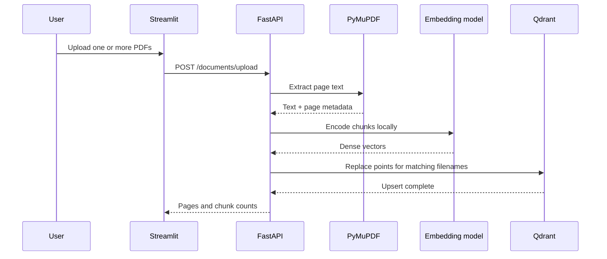
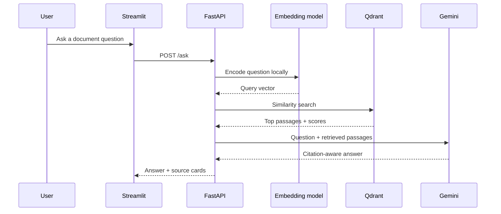

# Architecture

## Components

### Streamlit UI

Handles multi-PDF selection, indexing requests, questions, status display, JSON export, and source inspection. It communicates with FastAPI over HTTP and does not create embeddings itself.

### FastAPI API

Owns document ingestion and question answering. It validates uploads, coordinates parsing and embeddings, performs retrieval, calls Gemini, and returns structured source metadata.

### PyMuPDF parser

Extracts text page by page. Page metadata is preserved so the answer can point back to deterministic source locations.

### Chunker

Normalizes whitespace and creates overlapping page-level chunks. It attempts to end chunks near paragraph or sentence boundaries.

### Sentence Transformer

Runs locally and converts document chunks and questions into normalized dense vectors. Model files are cached under `data/models/`.

### Qdrant Local

Stores vectors and payload metadata in `data/qdrant/`. Each payload includes filename, page, chunk index, stored path, and original text.

### Gemini

Receives only the question and retrieved passages. The prompt requires numbered citations, refusal when evidence is insufficient, explicit handling of conflicting sources, and rejection of instructions embedded inside document text.

## Ingestion sequence

## Question-answering sequence

## Trust boundaries

- Local boundary: PDFs, extracted passage payloads, embeddings, Qdrant data, and model cache.
- External boundary: the question and retrieved passages sent to Gemini.
- Git boundary: `.env`, uploaded PDFs, vectors, and model cache are ignored.

## Scaling path

Qdrant Local is suitable for development and one local process. A production deployment should use secured object storage, a server or managed vector database, authentication, workspace or tenant isolation, audit logging, retention policies, malware scanning, observability, and rate limiting.

## OCR fallback

Each page is first processed with native PyMuPDF text extraction. If the normalized text is below the configured threshold and the page contains visual content, the page is rendered and processed through PyMuPDF's Tesseract integration. OCR is therefore page-selective rather than document-wide. The extracted OCR text enters the same chunking, embedding, retrieval, and citation pipeline as native PDF text.
